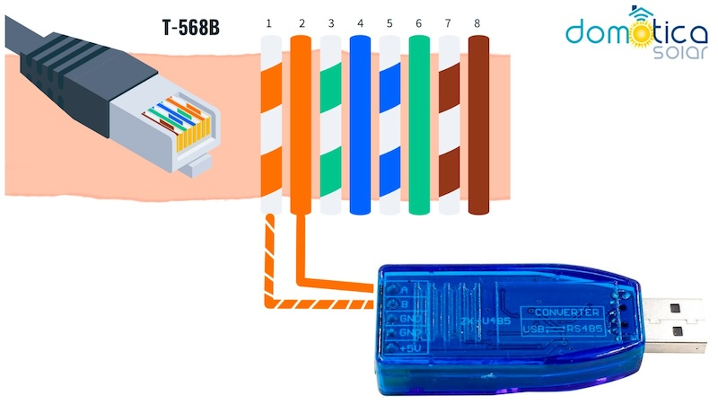
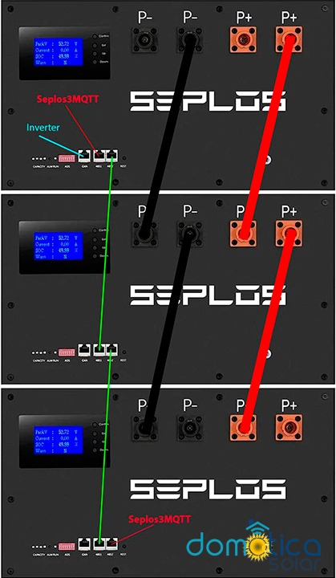

Seplos3MQTT
=============

Python script to connect a battery pack using BMS Seplos Version 3 to MQTT

Connect a USB to RS485 to any RS485 free port in your Seplos Pack.
MQTT also provides Home Assistant auto discovery

Documentation
-------------

```text
Usage:  
  python seplos3mqtt.py 

INI file:  
[seplos3mqtt]
serial = serial port
mqtt_server = mqtt server address
mqtt_port = mqtt server port
mqtt_user = mqtt username
mqtt_pass = mqtt password
mqtt_prefix = mqtt prefix
```





Project Informations
--------------------


### - License

### - Release Note

* 1.0.0 First release

Disclaimer
----------

THE SOFTWARE IS PROVIDED "AS IS", WITHOUT WARRANTY OF ANY KIND, EXPRESS OR IMPLIED, INCLUDING BUT NOT LIMITED TO THE WARRANTIES OF MERCHANTABILITY, FITNESS FOR A PARTICULAR PURPOSE AND NONINFRINGEMENT.
IN NO EVENT SHALL THE AUTHORS OR COPYRIGHT HOLDERS BE LIABLE FOR ANY CLAIM, DAMAGES OR OTHER LIABILITY, WHETHER IN AN ACTION OF CONTRACT, TORT OR OTHERWISE, ARISING FROM, OUT OF OR IN CONNECTION WITH THE SOFTWARE OR THE USE OR OTHER DEALINGS IN THE SOFTWARE.

